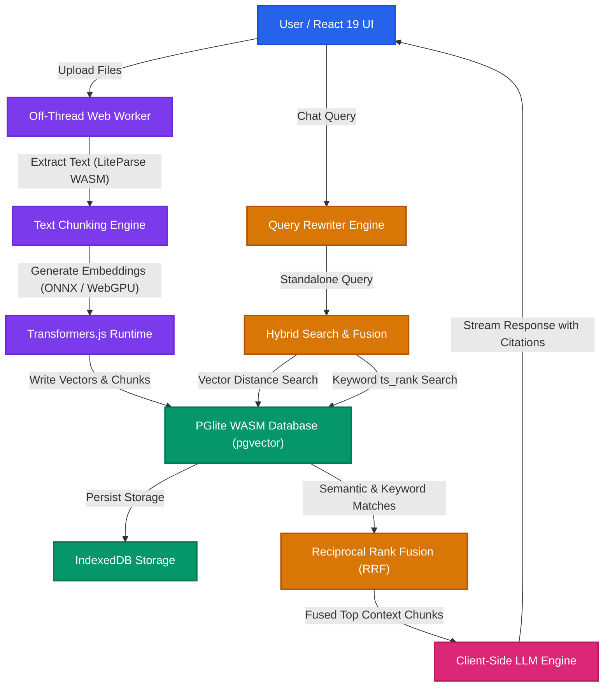

  
Table of Contents

  <TOCInline toc={props.toc} exclude="Introduction" />

## Introduction

What does it actually take to build a fully functional, production-grade Retrieval-Augmented Generation (RAG) system completely inside the browser?

Running a single local LLM demo or generating embeddings in a web page is straightforward today. However, building a complete RAG system requires stitching together multiple heavy data pipelines. You need client-side PDF parsing, off-thread text chunking, local vector generation, persistent database storage, hybrid search, and streaming LLM inference. Coordinating these components on the client side without freezing the user interface or exceeding browser sandbox memory limits is a complex engineering challenge.

To explore this, I built **Browser RAG**: a 100% local, zero-server knowledge engine that executes document parsing, vector indexing, hybrid retrieval, and LLM generation entirely on the user device without a single cloud API call or remote server dependency.

You can try the live interactive web application at [https://hari31416.github.io/browser-rag/](https://hari31416.github.io/browser-rag/) and inspect the open-source codebase on GitHub at [Hari31416/browser-rag](https://github.com/Hari31416/browser-rag).

<figure className="my-6">
  
  <figcaption>
    Figure 1: Browser RAG Chat Interface. Multi-turn local LLM chat with interactive citation
    tooltips displaying source document chunks and metadata.
  </figcaption>
</figure>

## The Motivation: Exploring the Boundaries of Browser AI

The primary motivation behind this project was technical exploration: I wanted to test the limits of modern browser runtimes and discover what works (and what breaks) when moving an entire AI data stack to the client device.

With recent breakthroughs in WebAssembly (WASM), WebGPU, and lightweight database engines, browsers are evolving into powerful execution environments. However, while running a single local model or embedding demo in JS is common today, stitching together an end-to-end RAG architecture (parsing, chunking, vector indexing, hybrid retrieval, and streaming LLM generation) pushes browser runtimes into uncharted territory.

Specifically, I wanted to answer four technical questions:

- **Can WASM databases handle real vector search?** Running PostgreSQL locally in WebAssembly via PGlite [^5] with `pgvector` [^2] and persistent IndexedDB storage.
- **Can off-thread Web Workers prevent UI freezes?** Offloading document text extraction, chunking, and matrix multiplication to background threads without dropping 60fps UI renders.
- **Is WebGPU ready for production LLM inference?** Evaluating token generation speeds, shader stability, and model weight storage across different local LLM engines.
- **What are the real browser limitations?** Handling strict browser memory caps, CacheStorage quota limits, and Cross-Origin Isolation headers (`COOP`/`COEP`).

Beyond pushing technical boundaries, building a 100% local stack brings powerful inherent benefits:

- **Zero-Trust Privacy**: Documents, embeddings, and chat queries never leave the browser sandbox, eliminating data leakage and compliance risks.
- **Offline Capability**: PWA Service Worker caching enables complete document parsing, search, and generation without an internet connection.
- **Zero Infrastructure Cost**: Eliminates recurring cloud server bills for vector databases, embedding endpoints, and LLM hosting.

## High-Level Architectural Blueprint

To deliver a production-grade RAG experience entirely within the browser, Browser RAG maps standard server-side RAG components directly to modern browser primitives:

| RAG Pipeline Component     | Traditional Cloud Architecture                | Browser RAG Primitive                      |
| :------------------------- | :-------------------------------------------- | :----------------------------------------- |
| **Document Parsing**       | Docling / Unstructured / LlamaParse Cloud API | `@llamaindex/liteparse-wasm` in Web Worker |
| **Off-Thread Compute**     | Celery / SQS Worker Nodes                     | Off-Thread Web Workers (Message Passing)   |
| **Vector Database**        | Pinecone / Qdrant / AWS S3 Vectors            | PGlite WASM (PostgreSQL) + `pgvector`      |
| **Persistent Storage**     | Managed Cloud DB Disk                         | IndexedDB Local Storage                    |
| **Embedding Engine**       | OpenAI Embeddings / Cohere API                | Transformers.js (ONNX Runtime WebGPU)      |
| **Hybrid Search & Fusion** | Elasticsearch + Vector DB + RRF               | PostgreSQL HNSW + `ts_rank` + SQL RRF      |
| **Query Rewriting**        | OpenAI API Pre-Pass                           | Local Lightweight LLM Pass                 |
| **LLM Inference**          | OpenAI / Anthropic / NVIDIA API               | WebLLM (WebGPU Shaders) / WASM Kernels     |

The system decouples document processing, retrieval, and inference into specialized modules connected by asynchronous worker bridges across three primary layers:

- **Ingestion & Indexing Layer**: Runs inside a dedicated Web Worker to extract text, chunk documents, compute embeddings, and insert vectors into PostgreSQL WASM.
- **Retrieval & Fusion Layer**: Executes hybrid vector search and full-text keyword matching inside PGlite, merging scores with Reciprocal Rank Fusion.
- **Inference & UI Layer**: Handles user interactions in React 19 [^7], performs query rewriting, streams local LLM tokens, and displays step-by-step debug traces.

To understand how these primitives interact in practice, let's trace the dual lifecycles of data in Browser RAG: first, how raw files are ingested and indexed off-thread, and second, how a user query moves through rewriting, hybrid retrieval, and client-side LLM synthesis.

## Ingestion & Indexing: Off-Thread Parsing and Chunking

Document ingestion is one of the most CPU-intensive stages of RAG. Extracting raw text from complex file formats and splitting text into structured chunks can easily lock the main browser UI thread if executed synchronously.

### Non-Blocking Worker Architecture

Browser RAG delegates all parsing, tokenization, and vector generation tasks to off-thread Web Workers. Communication occurs via structured message passing, keeping the main thread at a smooth 60 frames per second during heavy batch imports.

- **Asynchronous File Ingestion**: Files are transferred to workers as binary blobs or text streams.
- **Progress Tracking**: Real-time progress updates are emitted from the worker to update ingestion progress bars in the UI.
- **Error Isolation**: Ingestion failures in individual files are caught within worker boundaries without breaking application state.

### Multi-Format Text Extraction

The parsing engine supports `.pdf`, `.txt`, `.md`, `.json`, `.csv`, and `.html` files entirely on the client side:

- **PDF Parsing**: Powered locally by `@llamaindex/liteparse-wasm` [^1], compiling C++ PDF extraction routines to WebAssembly for reliable text extraction without server dependencies.
- **Structured File Parsing**: JSON and CSV files are parsed with schema-aware extractors to preserve key-value context and tabular headers across chunks.
- **Markdown & HTML Extraction**: Strips layout tags while preserving structural heading paths for context enrichment.
- **Extracted Chunk Metadata**: Each chunk captures content text, token count, page number, character offset range, and structural heading paths.

## Storage & Hybrid Retrieval: PGlite WASM and Vector Search

A core innovation of Browser RAG is embedding a full relational PostgreSQL database directly inside the browser using PGlite [^5], an open-source WebAssembly build of Postgres.

### PostgreSQL with pgvector in WASM

By loading the `pgvector` [^2] extension into PGlite, the browser gains access to native vector indexing algorithms and SQL query capability, with vector data stored persistently in IndexedDB.

The database manages document chunk tables containing unique identifiers, project context bounds, raw content text, JSONB metadata, and 384-dimensional vector embeddings indexed with HNSW cosine distance search. Multi-project workspaces isolate document scopes while locking dedicated embedding models per project to maintain mathematical vector consistency.

### Local Embedding Generation

Embeddings are generated locally using Transformers.js [^3] powered by ONNX Runtime Web [^4]. The engine utilizes WebGPU hardware acceleration when available on modern browsers, automatically falling back to WebAssembly multi-threading on older systems.

- **Model Locking**: Projects lock to a dedicated embedding model (such as `bge-small-en-v1.5`) upon creation to maintain mathematical vector consistency across indexed documents.
- **Batch Processing**: Texts are batched off-thread before passing to ONNX WebGPU tensors to maximize throughput.

### Hybrid Search and Reciprocal Rank Fusion

Relying solely on vector search can miss precise keyword matches like part numbers, proper nouns, or specific code symbols. Browser RAG combines vector distance matching with PostgreSQL full-text keyword search (`ts_rank`) using Reciprocal Rank Fusion (RRF).

The RRF algorithm scores each candidate document by combining its ordinal rank position across vector search and keyword search result lists:

$$
\text{RRF}\_{\text{score}}(d) = \sum_{m \in M} \frac{1}{k + r_m(d)}
$$

Where $k$ is a smoothing constant set to 60, and $r_m(d)$ represents the rank position of document $d$ within retrieval method $m$.

<figure className="my-6">
  
  <figcaption>
    Figure 2: Hybrid Search and Reciprocal Rank Fusion (RRF) Process. Combining semantic vector
    distance with full-text keyword ranking in PGlite.
  </figcaption>
</figure>

## Query Processing, Generation, and Traceable Synthesis

Once raw user input is received, Browser RAG executes a three-stage synthesis pipeline: conversational rewriting, candidate context retrieval, and local LLM generation.

### Conversational Query Rewriting

In multi-turn chat sessions, user follow-up questions often contain ambiguous pronouns or implicit references (such as "What is its license?"). Before performing database retrieval, a light local LLM pass evaluates the conversation context and converts incomplete follow-up questions into clear standalone search queries prior to database lookup.

### Selectable Local LLM Engines

Once relevant document chunks are retrieved and fused via RRF, they are passed as context to client-side Large Language Models running in browser memory. Browser RAG supports multiple local inference engines, with model loading and engine switching runtimes ported and adapted from `local-voice-chat` [^8]:

- **WebLLM**: Powered by WebLLM [^6], executing quantized LLMs (such as Llama 3, Qwen 2.5, or Phi 3) using WebGPU shaders for high token-per-second generation speed.
- **Transformers.js & Custom WASM Kernels**: Provides fallback inference runtimes for lightweight or specialized model architectures like Gemma-4-kernel and LFM2-kernel.

### Traceable Citations and Thinking Blocks

Generated LLM responses feature interactive citation tooltips. Each citation directly maps to the exact document chunk and page number retrieved during search. Deep reasoning "thinking" blocks are rendered in separate collapsible UI containers for complete transparency into model reasoning.

## Browser Storage, Headers, and Isolation

Running production software in the browser sandbox requires addressing hardware limitations, storage quotas, and web security policies.

### PWA and Cross-Origin Headers

Browser RAG is packaged as a Progressive Web App (PWA) with Service Worker caching. To support high-performance WebAssembly multi-threading and `SharedArrayBuffer` memory access, the application configures Cross-Origin Isolation headers:

- `Cross-Origin-Opener-Policy`: `same-origin`
- `Cross-Origin-Embedder-Policy`: `require-corp`

### Model Weight Storage Inspector

Downloaded LLM and embedding model weights can consume gigabytes of browser `CacheStorage`. The storage manager provides visual quota monitoring and one-click weight cache purging while keeping IndexedDB vector data intact.

<figure className="my-6">
  
  <figcaption>
    Figure 3: Model Weight Storage Inspector UI. Visual quota breakdown of browser storage,
    CacheStorage allocations per model, and single-click weight cache purging.
  </figcaption>
</figure>

### Workspace Backup and Restoration

To protect local data and allow migration between devices, Browser RAG features complete workspace import and export functionality:

- Workspaces containing project settings, indexed document chunks, vector tables, and chat history are packaged into standard `.tar.gz` compressed archives.
- Users can back up their entire vector database and restore it instantly on another browser without re-indexing.

## Developer Experience and RAG Observability

Debugging RAG retrieval failures can be difficult without internal visibility into search scores and pipeline steps. Browser RAG includes built-in observability tools directly inside the application interface.

### Retrieval Debug Panel

The Debug UI allows developers and users to inspect every step of the retrieval pipeline in real time:

- **Query Comparison**: Displays raw user input alongside the LLM rewritten query.
- **Score Transparency**: Shows vector cosine distance scores, keyword `ts_rank` positions, and calculated RRF fusion weights side-by-side.
- **Pipeline Latency**: Tracks precise execution timings for query rewriting, embedding generation, database query execution, and LLM first-token generation.

<figure className="my-6">
  
  <figcaption>
    Figure 4: Retrieval Debug Panel UI. Inspect user query vs rewritten query, vector distance
    scores, keyword ts_rank positions, RRF weights, and pipeline timings.
  </figcaption>
</figure>

### Document Chunk Explorer

The Document Chunk Explorer allows users to browse parsed chunks for any file in the workspace:

- View total token count and character boundaries per chunk.
- Inspect extracted structural heading paths and page numbers.
- Manually test vector distance matches against specific chunks.

<figure className="my-6">
  
  <figcaption>
    Figure 5: Document Chunk Explorer UI. Preview parsed document chunks, token counts, character
    offsets, and structural heading paths.
  </figcaption>
</figure>

## Key Learnings and Future Roadmap

Building Browser RAG demonstrated that modern web browsers possess sufficient computational capability to run complex AI data pipelines locally.

### Key Learnings

- **Off-Thread Execution is Mandatory**: Performing heavy vector or parsing operations on the main thread destroys user experience. Web Workers are indispensable.
- **Hybrid Search Outperforms Single Strategy**: Fusing full-text keyword search with semantic vectors using RRF consistently yields higher precision than vector search alone.
- **WebGPU Adoption**: Hardware-accelerated WebGPU dramatically improves embedding generation and LLM token throughput compared to WebAssembly CPU fallback.

### Future Roadmap

- **Expanded Document Formats and OCR**: Expanding support to additional formats (such as `.docx`, `.pptx`, and `.epub`) and performing client-side Optical Character Recognition (OCR) on scanned documents using Tesseract.js in WebAssembly.
- **Multi-Modal Local Indexing**: Supporting client-side image, diagram, and audio embedding extraction using local vision-language and multi-modal models running in WebGPU.
- **Advanced RAG Retrieval Features**: Implementing client-side cross-encoder neural reranking, query decomposition into parallel sub-queries, and local knowledge graph extraction for multi-hop reasoning.
- **Shared Worker Vector Service**: Enabling multiple browser tabs to query a single shared PGlite vector worker instance.

## Project Links and Library References

### Project Resources

- **Live Application**: [Browser RAG Web App](https://hari31416.github.io/browser-rag/)
- **GitHub Repository**: [Hari31416/browser-rag Source Code](https://github.com/Hari31416/browser-rag)
- **Foundational Voice AI Repository**: [Hari31416/local-voice-chat](https://github.com/Hari31416/local-voice-chat)

### Core Libraries and Technologies

- **UI Framework & Routing**: [React 19](https://react.dev/), [Vite](https://vitejs.dev/), [Tailwind CSS v4](https://tailwindcss.com/), [shadcn/ui](https://ui.shadcn.com/), [TanStack Router](https://tanstack.com/router), [TanStack Query](https://tanstack.com/query).
- **Database & Vectors**: [PGlite](https://pglite.dev/) compiled via WebAssembly, [pgvector](https://github.com/pgvector/pgvector) extension, and browser IndexedDB storage.
- **Embeddings & Inference**: [Transformers.js](https://huggingface.co/docs/transformers.js), [ONNX Runtime Web](https://onnxruntime.ai/), [WebLLM](https://webllm.mlc.ai/).
- **Document Parsing**: [@llamaindex/liteparse-wasm](https://www.npmjs.com/package/@llamaindex/liteparse-wasm) for client-side PDF parsing.

[^1]: [@llamaindex/liteparse-wasm Package on npm](https://www.npmjs.com/package/@llamaindex/liteparse-wasm)

[^2]: [pgvector PostgreSQL Extension GitHub Repository](https://github.com/pgvector/pgvector)

[^3]: [Transformers.js Hugging Face Documentation](https://huggingface.co/docs/transformers.js)

[^4]: [ONNX Runtime WebGPU Provider Documentation](https://onnxruntime.ai/docs/execution-providers/WebGPU-ExecutionProvider.html)

[^5]: [PGlite by ElectricSQL Documentation](https://pglite.dev/)

[^6]: [WebLLM by MLC AI Documentation](https://webllm.mlc.ai/)

[^7]: [React 19 Documentation](https://react.dev/)

[^8]: [Hari31416/local-voice-chat GitHub Repository](https://github.com/Hari31416/local-voice-chat)
