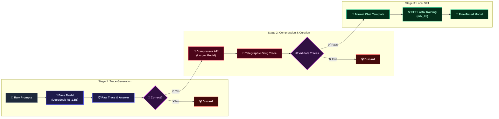

  
Table of Contents

  <TOCInline toc={props.toc} exclude="Introduction" />

# Introduction

Open-source reasoning models are notorious for reasoning too much. Generating long, verbose chain-of-thought (CoT) traces makes up a massive chunk of inference latency and processing costs. In contrast, OpenAI has been highly successful with their newer models, specifically the GPT 5.x series, in terms of utilizing very few tokens to deliver excellent task performance.

The question arises: why is the GPT 5.x series of models so token-efficient? Sadly, OpenAI does not expose their reasoning tokens, meaning we cannot inspect their exact reasoning process directly. All we can do is theorize. One such theory, known as the **Grug Hypothesis**, is that OpenAI models might not reason in full, grammatically correct sentences internally. Instead, to optimize token generation and minimize latency, they might reason in a highly compressed, telegraphic style, dropping articles, pronouns, and polite filler words. This hypothesis is supported by some leaked reasoning traces of GPT 5.x models.

Fascinated by this theory, I wanted to see if I could perform a similar reasoning style transfer on a small, local model. In this post, I walk through my experiment to fine-tune DeepSeek-R1-Distill-Qwen-1.5B to internalize a telegraphic "caveman" reasoning style without sacrificing task accuracy. You can find the complete codebase in the [qwen-grug-finetune GitHub repository](https://github.com/Hari31416/qwen-grug-finetune), and the datasets and fine-tuned models on the [Hugging Face repository](https://huggingface.co/hari31416/qwen-grug-finetune).

Here is how I built the data curation pipeline, the roadblocks I encountered during training, and what I learned about local SFT regularization.

## The Motivation: Token Efficiency in Reasoning

When a reasoning model emits a long internal monologue, every generated token adds latency and inference cost. If a model can compress its logical steps into a grammar-stripped shorthand, it saves processing time and bandwidth.

I wanted to explore this concept locally on consumer hardware. My objectives were simple:

- Learn to design and curate a custom Supervised Fine-Tuning (SFT) pipeline.
- Train and evaluate models locally on Apple Silicon using the MLX framework [^1].
- Verify if a small model can learn to restrict its thinking style natively without relying on verbose, hardcoded system instructions that bloat context windows.

For my base model, I selected the open-weights DeepSeek-R1-Distill-Qwen-1.5B-4bit [^2] and ran training on a local Mac M4 GPU.

## The SFT Pipeline: How to Compress a Mind

To train my model, I had to build an automated data curation pipeline. The goal was to take verbose, high-quality reasoning traces and rewrite them in a telegraphic format.

The pipeline comprises six distinct stages:

- **Stratified Prompt Sampling**: I sampled prompts across six source datasets (StrategyQA [^3], LogiQA [^4], BoolQ [^5], ANLI [^6], PIQA [^7], and ReClor [^8]) using a prompt-sampling script. I scaled the prompt database from 1,000 in my first run to 4,000 in the second run to ensure a high-yield dataset.
- **Verbose Trace Generation**: I evaluated the prompts using the base model. Only prompts where the model generated a correct final answer against the ground truth were kept. This step, handled during the generation phase, filtered out hallucinated reasoning paths.
- **Trace Compression**: I sent the correct verbose traces to an API for a larger model acting as the "compressor." The compressor rewrote the verbose reasoning monologue into a grammar-stripped, telegraphic format using rules defined in a custom style guide. For example:
  - _Verbose Trace:_ "To find the total amount of money they have, first I need to calculate how much Sarah has. Sarah has \$10. Then the problem says Mark has 3 times as much money as Sarah. So Mark has 3 \* \$10 = \$30. Let me add them. \$10 + \$30 = \$40. So the total sum is \$40."
  - _Compressed Trace:_ "Sarah 10. Mark 3 times Sarah, so 30. Total 10 + 30 = 40."
- **Automated Style Validation**: I filtered the outputs via an automated trace validation script. I discarded any compressed trace that exceeded 50% of the raw trace's length, omitted critical numeric facts, or contained meta-commentary (such as "Wait, let me think...").
- **Chat Template Formatting**: I combined the user prompt and the compressed trace into a single assistant response. Since standard templates often strip `<think>` tags during tokenization, I formatted only the user prompt and manually appended the `<think>compressed_thinking</think>\n\nfinal_answer` suffix.
- **Local SFT LoRA Training**: I wrapped the MLX training library [^9] in a custom training script to run AdamW optimization locally on the Mac M4.

## Key Engineering Decisions

### Discarding Incorrect Traces

During raw trace generation, I automatically discarded any sample where the model's final generated answer did not match the ground truth. Fine-tuning models on reasoning requires the highest data purity. If I had included traces that led to incorrect answers, the model would have learned to internalize and reinforce faulty logic, errors, and hallucinations.

### Moving from Discarding to Mixing Verbose Traces

In the initial iteration, my approach was to completely discard all raw, verbose reasoning traces once they were compressed, training only on the "positive" (Grug-compressed) samples. However, this absolute filtering strategy created a model that could only reason in one way, leading to severe instruction overfitting and prompt leakage.
To fix this, I changed my data layout. Instead of discarding the raw verbose traces, I mixed them back into the SFT dataset as negative examples (representing normal, verbose reasoning). Teaching the model both styles—and when to apply which—regularized the SFT adapter and successfully stopped the model from regurgitating the formatting prompt.

### Objective Quality Metric: The Grug Score

To avoid relying purely on subjective evaluations of whether the model's output sounded "Grug-like," I implemented an automated evaluation module. This module computes a custom "Grug Score" using objective heuristics: token-level compression ratio (using the model's tokenizer), article density (occurrences of "the," "a," "an" per 100 words), absence of forbidden meta-commentary words like "wait" or "actually," and average word count per period-separated fragment. This programmatic scoring enabled rapid, metric-driven iteration.

## The Roadblocks: Failure Modes of Distilled Reasoning

Fine-tuning reasoning models is highly sensitive. Along the way, I encountered three major failures.

### 1. Small Standard Models Fail at Reasoning Loops

My first choice, Qwen-3.5-0.8B-Instruct, failed completely during trace generation. Because standard instruct checkpoints are not aligned using reinforcement learning (RL) specifically for multi-step reasoning, forcing them to output a thinking block caused them to enter infinite self-correcting loops (e.g., repeating "Wait, is X correct? No, because Y. Wait..." until hitting the generator cap).

Pivoting to `DeepSeek-R1-Distill-Qwen-1.5B` resolved this, as it natively structures its thoughts inside `<think>` tags and reliably emits the closing token.

### 2. Prompt Leakage and Instruction Regurgitation

In my early runs, the model overfit to the custom system instructions. During evaluation, instead of reasoning about the user's problem, the model would parrot the SFT instructions inside the `<think>` block (e.g., repeating "You must think in short, telegraphic fragments. Do not use articles...").

To solve this, I implemented **SFT Regularization**:

- **System Prompt Dropout:** I omitted the system prompt on 20% of positive training examples.
- **Negative Example Mixing:** I mixed in 30% uncompressed, verbose traces to show the model how to reason normally when not prompted.
- **Negative System Prompting:** I retained the system prompt on 50% of negative instances to train the model not to over-compress reasoning unconditionally.

### 3. The Math Alignment Tax

While the regularized model successfully internalized the telegraphic style, its accuracy on the Grade School Math (GSM8K [^10]) test split dropped from 70.1% to 54.6%.

Because my SFT dataset consisted of general reasoning tasks and lacked math-specific problems, the model compressed mathematical reasoning too aggressively. It dropped mathematical derivations, intermediate equations, and calculation checks, leading to downstream errors.

## Experimental Results

Despite the setbacks, the results show that reasoning style transfer is highly effective at saving tokens and latency.

| Metric                   | Base Model (Style Prompt) | Fine-Tuned Model (Regularized) |       Performance Change        |
| :----------------------- | :-----------------------: | :----------------------------: | :-----------------------------: |
| **Accuracy**             |           70.1%           |             54.6%              |    -15.5 pp (Alignment Tax)     |
| **Mean Thinking Tokens** |           517.4           |             135.0              |    **-73.9%** (Tokens Saved)    |
| **Mean Total Tokens**    |           582.1           |             214.7              |  **-63.1%** (Bandwidth Saved)   |
| **Mean Latency**         |           1.28s           |             0.61s              |      **-52.3%** (Speedup)       |
| **Format Compliance**    |           91.1%           |             98.2%              | **+7.1 pp** (Format Stickiness) |

The regularized model achieved complete format compliance stickiness (**98.2%**) and completely resolved prompt regurgitation.

> **Formatting Reliability (Weight-Level vs. Brittle Prompt Alignment):** Fine-tuning with SFT regularization successfully baked the structural `<think>...</think>` delimiters directly into the model's weight representations. The fine-tuned model achieved **98.2% format compliance**, whereas the base model under style prompting sat at **91.1%**. This proves that SFT regularization aligns formatting constraints at a structural weight level far more robustly and permanently than brittle system prompting alone.

<figure className="my-6">
  
  <figcaption>
    Figure 1: GSM8K Experimental Evaluation Metrics. Accuracy, token breakdown, and inference
    latency comparison between base model under style prompting and fine-tuned model.
  </figcaption>
</figure>

## Next Steps: Moving Forward

To build on these findings, I plan to address the capacity limits and math tax in future iterations:

- **Scale to a 7B Parameter Base Model:** Transition to DeepSeek-R1-Distill-Qwen-7B-4bit (already configured in the repository) to leverage its greater representation capacity, which should help absorb style constraints without degrading core logic or math accuracy.
- **Calibrate Hyperparameters for Local 7B Training:** To train the larger 7B model locally on consumer Apple Silicon, I plan to configure a batch size of 2 with gradient accumulation steps of 2 (effective batch size of 4) and enable gradient checkpointing to prevent VRAM memory failures on the M4 GPU.
- **Task-Specific SFT Mixing:** Generate and inject compressed math-specific (GSM8K) training traces into the dataset to teach the model how to express derivations telegraphically without skipping calculations.
- **Calibrate Adapter Capacity:** Reduce the LoRA rank from 16 to 8 or 4 to act as an implicit regularizer, preventing the adapter from overriding the base weights too aggressively.

[^1]: [MLX Framework GitHub Repository](https://github.com/ml-explore/mlx)

[^2]: [DeepSeek-R1-Distill-Qwen-1.5B-4bit Hugging Face Model](https://huggingface.co/mlx-community/DeepSeek-R1-Distill-Qwen-1.5B-4bit)

[^3]: [StrategyQA Dataset Hugging Face](https://huggingface.co/datasets/ChilleD/StrategyQA)

[^4]: [LogiQA Dataset Hugging Face](https://huggingface.co/datasets/lucasmccabe/logiqa)

[^5]: [BoolQ Dataset Hugging Face](https://huggingface.co/datasets/google/boolq)

[^6]: [ANLI Dataset Hugging Face](https://huggingface.co/datasets/facebook/anli)

[^7]: [PIQA Dataset Hugging Face](https://huggingface.co/datasets/baber/piqa)

[^8]: [ReClor Dataset Hugging Face](https://huggingface.co/datasets/hadithya369/ReClor)

[^9]: [MLX LM Training Library GitHub Repository](https://github.com/ml-explore/mlx-lm)

[^10]: [GSM8K Dataset Hugging Face](https://huggingface.co/datasets/openai/gsm8k)
