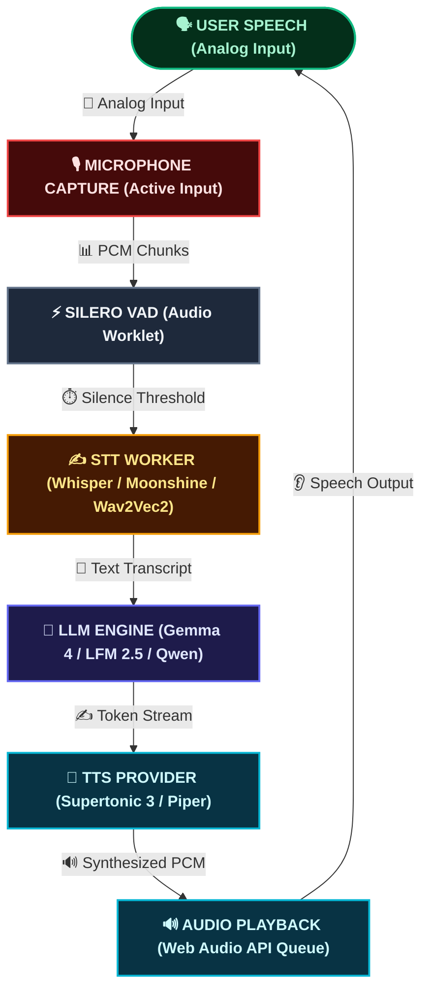
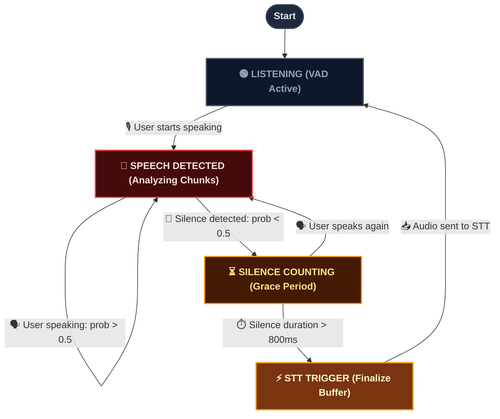
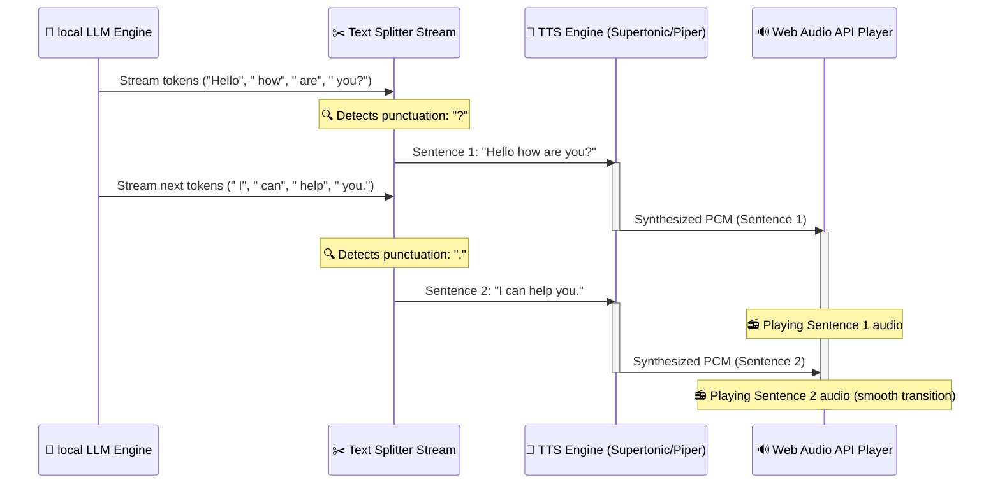

  
Table of Contents

  <TOCInline toc={props.toc} exclude="Introduction" />

# Building WebVoice Studio: How I Built a 100% Offline, In-Browser Voice AI Playground

Over the last year, WebAssembly (WASM) has matured, WebGPU has landed in mainstream browsers, and machine learning models have shrunk to sizes that fit comfortably on a phone or a modest laptop. To utilize this, I built **WebVoice Studio**. This is a fully local, zero-server voice AI workbench that runs entirely in your browser. Try the live app at [voice.hari31416.in](https://voice.hari31416.in/).

The application runs **offline after the first load**. On first launch, it downloads the selected models from the Hugging Face CDN. These model sizes range from ~27 MB for a lightweight STT model to ~3.2 GB for the full Gemma 4 stack. Everything is cached in IndexedDB or the browser cache. After that, the system requires no server, no API keys, and no data leaving your device.

Here is how it works and what I learned while building it.

## Why WebVoice Studio

I had a few overlapping reasons for taking this on, which boil down to three themes:

**Technology curiosity.** I watched WASM and WebGPU make the browser a serious compute platform. I saw isolated demos, such as a local LLM, a standalone TTS, and a basic STT. Projects like [activated-intelligence/voice-chat](https://github.com/activated-intelligence/voice-chat) came close, but did not have the option to choose other LLMs, or swap out the TTS and STT engines. No single open-source project stitched them into a continuous voice conversation, at least not in some indic language, like Hindi as well. Hugging Face Spaces demos of raw WebGPU kernels for Gemma 4 and Liquid LFM 2.5 convinced me browser AI could be fast enough for real-time speech.

**Real-world need.** In my work with the Indian government, I regularly encounter deployment scenarios where clients need systems that work fully offline on smaller, air-gapped devices. I wanted to build a working implementation rather than a slide deck.

**Personal learning and future-proofing.** I wanted to build a voice agent for a long time. This felt like the right moment to learn voice-agent design and modern browser AI in one project. I also wanted a sandbox to test new STT and TTS models as they ship, benchmark them in a realistic call environment, and prepare for a future where sub-1B models are sufficient for voice-directed tasks.

## Roadmap of the Deep Dive

To help navigate the moving parts of a fully local speech-to-speech system, this article is structured as a progressive walk-through. It starts with the hardware requirements and the overall architecture of the browser-native voice loop. Next, it covers the user-facing capabilities and presets of the studio playground. From there, it explores the three core engineering pillars: **Speech-to-Text (STT)** with low-latency Voice Activity Detection (VAD), **local LLM execution** leveraging custom WebGPU kernels, and **Text-to-Speech (TTS)** streaming with the Web Audio API. Finally, I will unpack the hard lessons learned dealing with browser memory constraints, WebGPU leaks, and mobile-specific optimization.

## Requirements

Before trying to run this app on your browser, make sure that the following requirements are met:

- **Browser**: Chrome 113+ or Edge 113+. WebGPU is recommended for STT and the larger LLM or TTS stacks.
- **RAM**: ~6 GB available for the full voice stack (Gemma 4 E2B + STT + TTS). Less memory is required for text-only or smaller WebLLM models.
- **Microphone**: This is only required when STT is enabled.
- **First launch**: An internet connection to download models from Hugging Face. After the initial download, the application works fully offline.

TTS falls back to WASM if WebGPU is unavailable. Piper always runs via WASM. On iOS, the app defaults to smaller WebLLM models and Piper TTS due to WebGPU limitations.

## The Architecture of a Browser-Native Voice Loop

Building a voice agent is different from building a text chat. In text, a few seconds of latency is acceptable. In voice, anything over ~500 ms feels awkward.

To keep latency low entirely within the browser, WebVoice Studio uses a modular, worker-driven architecture. The core pipeline is a continuous loop:

- **Audio Capture**: The browser microphone captures user speech.
- **Voice Activity Detection (VAD)**: A lightweight Silero VAD model running inside a browser AudioWorklet monitors the input. It flags when the user starts and stops speaking.
- **Speech-to-Text (STT)**: The captured audio buffer goes to a background Web Worker running a local ASR model, such as Whisper, Distil-Whisper, Moonshine, or Wav2Vec2, to transcribe the speech.
- **Large Language Model (LLM)**: The transcribed text goes to a local LLM runner. Supported engines include Gemma 4, Liquid LFM 2.5, Qwen 3.5, or a WebLLM model (Qwen or Llama). These are optimized via WebGPU or WASM.
- **Text-to-Speech (TTS)**: The text stream is split into sentences in real time. Each sentence is immediately synthesized to audio using Supertonic 3 or Piper.
- **Audio Playback**: Synthesized audio is queued and played back smoothly through the Web Audio API.

All model loading and inference run inside dedicated Web Workers to keep the main thread responsive. The React frontend handles orchestration and the user interface.

## Features and Interaction Modes

WebVoice Studio functions as both a conversational voice agent and an all-in-one sandbox for testing browser-based AI across multiple configurations.

<figure className="my-6">
  
  <figcaption>
    Figure 1: Setup Presets & Blueprint Configuration Wizard. Choose between performance profiles
    and review model download sizes before launching.
  </figcaption>
</figure>

### 1. The Conversational Voice Agent

When running the main Voice Agent studio, you can:

- **Go full hands-free**: A natural, continuous voice call overlay with pulsing status rings and live waveforms.
- **Push-to-talk or force submit**: Hold a button to speak, or hit Force Submit to instantly transcribe and send whatever audio you have captured so far.
- **Mix and match modalities**: Disable STT to type queries while listening to spoken replies. Disable TTS to speak to the agent and read markdown responses. Run in pure text mode with no mic at all.
- **Multimodal input**: In text mode, attach images to your messages. Gemma 4 E2B and Qwen 3.5 process them locally via vision. This is useful for "what's in this screenshot?" style queries without sending anything to a cloud API.
- **Thinking blocks**: Toggle LLM reasoning on or off. When enabled, the model's internal chain-of-thought renders as a collapsible markdown block above the final answer.
- **Tool calling**: Enable in-browser tool use. The LLM can invoke tools from a small client-side registry, such as `get_current_time` and a calculator. The engine executes them entirely in the browser, and appends the results to its response. You can ask "what time is it?" or "what's 847 times 23?" and the model handles it locally.
- **Tweak advanced settings**: Configure generation parameters, pick your LLM, STT, or TTS stack, and switch models from the control bar mid-session.

### 2. Standalone TTS and STT Studios

Beyond the main voice loop, there are dedicated sandboxes for individual tasks:

- **TTS Studio**: Type any text, pick your TTS engine (Supertonic 3 or Piper), select voice styles or speakers, and generate audio blocks locally.
- **STT Studio**: Test local speech recognition by recording from your microphone or dropping WAV or MP3 files into the browser. This environment lets you compare model speeds and transcription accuracy side by side.

### 3. Session Blueprints and Presets

On first launch, you configure a session blueprint using performance presets. These options include **Fast & Light** for low-spec or mobile devices, **Balanced**, or **Flagship** for larger Gemma 4 and Whisper models. You can also fine-tune settings in the Advanced Settings panel. The setup screen shows live download size estimates so you know what you are downloading before the process starts.

## Pillar 1: Speech-to-Text & The Silence Detector

The voice agent needs to know when you are speaking. If you pipe continuous audio into the transcription engine, the browser will crash or run out of memory quickly.

### Voice Activity Detection (VAD)

I integrated the **Silero VAD** model (~2 MB) [^1] using ONNX Runtime. Audio is captured via `AudioContext` and processed frame-by-frame in 512-sample chunks within a custom AudioWorklet. The worklet sends float arrays to the VAD runner, which scores each chunk for human speech.

Once VAD detects silence for a threshold duration, which is typically 800 to 1000 ms after speaking, it fires a trigger to finalize the audio buffer. This buffer is then passed to STT.

### Local Speech-to-Text (STT) Engines

Different devices have different constraints. I integrated four STT engine families via Hugging Face Transformers.js:

- **Moonshine** (27 MB to 61 MB) [^2]: Ultra-lightweight English ASR from Useful Sensors. It is fast on lower-spec machines.
- **Whisper** (75 MB to 480 MB) [^3]: Standard model for multilingual transcription.
- **Distil-Whisper** (150 MB to 750 MB) [^4]: A distilled Whisper that is smaller and faster while maintaining accuracy.
- **Wav2Vec2** (360 MB to 1.2 GB) [^5]: This model is CTC-based. It does not use autoregressive decoding. Inference is fast, though it is more sensitive to background noise.

All STT engines live in a dedicated background worker (`stt-worker-esm.js`) and run off the main thread.

<figure className="my-6">
  
  <figcaption>
    Figure 2: STT Studio Interface. Standalone sandbox showing active microphone recording and
    transcribing audio files locally.
  </figcaption>
</figure>

## Pillar 2: The LLM Brain (Raw WebGPU & Custom Kernels)

Once the transcribed text is ready, it routes to a local LLM. This is where browser AI has made the biggest leaps in the last year.

Traditionally, running LLMs in the browser meant downloading large MLC WebLLM bundles or using heavy ONNX runtimes. Community developers on Hugging Face have been building custom, raw WebGPU kernels optimized for mobile-friendly architectures. These custom kernels deliver significant speedups. The [Gemma 4](https://huggingface.co/spaces/webml-community/gemma-4-webgpu-kernels) and [Liquid LFM 2.5](https://huggingface.co/spaces/webml-community/lfm2-webgpu-kernels) kernel demos showed roughly **10× faster generation** compared to generic ONNX paths. This was the key factor in making voice feel conversational.

WebVoice Studio supports:

- **Gemma 4 E2B** (~3.2 GB) [^6]: Custom WebGPU kernels (`use-gemma4.ts`) for fast generation. It also supports vision for image input.
- **Liquid LFM 2.5** (230 MB to 350 MB) [^7]: Ultra-small model on specialized WebGPU kernels (`use-lfm2.ts`). This model is suitable for low-end devices.
- **Qwen 3.5** (0.8B to 4B): ONNX and WebGPU runtime with strong multilingual comprehension and vision support.
- **WebLLM models** (400 MB to 2 GB) [^8]: Qwen 0.5B or 1.5B and Llama 3.2 1B or 3B via the MLC WebLLM runtime. This is the fallback path for iOS and memory-constrained devices.

### Unifying the Stack with Vercel AI SDK

To manage streaming, history, and tool execution, I unified the LLM layer under the Vercel AI SDK (v6). Every model adapter plugs into the same harness. Supported adapters include Gemma 4, LFM 2.5, Qwen 3.5, and WebLLM. This configuration ensures that switching models does not require rewriting the conversation loop.

Tool calling works through a small in-browser registry. When you ask "What time is it?", the local LLM emits a tool call. The browser executes `get_current_time` client-side, injects the result back into the prompt, and continues generating. This avoids a round trip to a server. The same pattern works for arithmetic via the calculator tool. You can toggle tool calling on or off from the setup screen or control bar.

## Pillar 3: Text-to-Speech & Audio Streaming

If you wait for the LLM to finish its entire response before starting TTS, the user waits through 5 to 10 seconds of silence. That delays the voice response.

The solution is to stream the text response sentence by sentence. A custom text splitter watches for punctuation, such as periods, question marks, and newlines. The splitter dispatches each complete sentence to the TTS engine the moment it is ready.

### TTS Engines in the Playground

There are two TTS backends:

- **Supertonic 3** (~400 MB) [^9]: High-fidelity engine for English, Hindi, and mixed Hinglish. It runs on WebGPU with a WASM fallback.
- **Piper** (~15 MB to 75 MB per voice) [^10]: Fast, lightweight WASM engine. Individual voice profiles download on demand from the Rhasspy Piper voice registry.

Synthesized PCM blocks feed into a Web Audio playback queue that handles crossfading and scheduling. This ensures that speech sounds continuous rather than choppy.

<figure className="my-6">
  
  <figcaption>
    Figure 3: TTS Studio Interface. Custom sandbox for generating speech from text and testing voice
    style profiles locally.
  </figcaption>
</figure>

## The Hard Engineering Realities of Browser AI

Building this project surfaced several browser-specific roadblocks. If you are building something similar, watch for these issues.

### 1. WebGPU Tensor Memory Leaks

WebGPU memory is not garbage-collected by the JavaScript runtime. Every model forward pass through ONNX Runtime Web or custom shader kernels allocates GPU buffer memory.

If you do not explicitly call `.dispose()` on unused tensors, the browser runs out of GPU memory quickly. This typically results in a silent crash or an unexpected page refresh. I implemented a strict resource-disposal lifecycle in the model hooks so every tensor is freed immediately after use.

### 2. Silero VAD Tensor Crash

The same memory management issue occurs with VAD. During continuous listening, the VAD model allocates tensors for state tracking. Without proper cleanup, page memory spikes. I wrapped VAD inference in a memory manager that resets state and clears references when speech transitions to silence.

### 3. iOS/Mobile WebGPU Limitations

iOS Safari has limited, experimental WebGPU support, and mobile tabs are often capped at 1 to 2 GB of memory.

The workarounds:

- Detect mobile browsers and set fallback defaults automatically.
- On iOS, default to **Qwen 0.5B** via WebLLM and Piper TTS via WASM instead of WebGPU.
- Show clear memory warnings on the setup screen when a blueprint exceeds the device's estimated limits.

### 4. Localization and Transliteration (Hindi & Hinglish)

For government use cases in India, Hindi and Hinglish support is required. I added:

- **Lipilekhika integration**: A built-in keyboard transliterator that converts Roman input (typing "namaste") into Devanagari ("नमस्ते") in real time.
- **Gender prompt alignment**: System prompts adapt dynamically to the selected TTS voice gender. Hindi verb endings match male or female speaker profiles.

## Designing the Experience: Obsidian Signal UI

A local AI project should not feel like a terminal script. I wanted the interface to look polished and interactive.

The design system is built on a dark obsidian aesthetic with emerald accents and glassmorphic panels. When you enter an active voice session:

- The screen transitions to an immersive calling view.
- A central pulsing ring visualizes VAD state. The ring turns green when you speak and pulses emerald when the agent is thinking.
- A custom LED-matrix-style waveform player shows speech playback for both you and the assistant.
- Three blueprints, Fast & Light, Balanced, and Flagship, let you trade download size and quality without modifying every setting.

<figure className="my-6">
  
  <figcaption>
    Figure 4: Active Call View. Immersive calling window showing real-time waveform tracking and
    status indicators.
  </figcaption>
</figure>

## Shoutouts & References

This playground relies on the open-source community:

- **Voice Pipeline Foundation**: [activated-intelligence/voice-chat](https://github.com/activated-intelligence/voice-chat)
- **Text-to-Speech Engines**: [Supertonic 3](https://github.com/supertone-inc/supertonic) (high-fidelity multilingual) and [Piper](https://github.com/rhasspy/piper) / [rhasspy/piper-voices](https://huggingface.co/rhasspy/piper-voices) (lightweight voices)
- **Speech Models**: [Whisper](https://github.com/openai/whisper) (OpenAI), [Distil-Whisper](https://github.com/huggingface/distil-whisper) (Hugging Face), [Moonshine](https://github.com/usefulsensors/moonshine) (Useful Sensors), and [Wav2Vec2](https://github.com/facebookresearch/fairseq/tree/main/examples/wav2vec) (Meta AI)
- **LLMs & Optimization**: [Gemma 4 E2B ONNX](https://huggingface.co/onnx-community/gemma-4-E2B-it-ONNX), [WebLLM](https://github.com/mlc-ai/web-llm) (MLC AI), and the custom raw WebGPU kernel references for [Liquid LFM 2.5](https://huggingface.co/spaces/webml-community/lfm2-webgpu-kernels) and [Gemma 4](https://huggingface.co/spaces/webml-community/gemma-4-webgpu-kernels)
- **Inference Runtime**: [Transformers.js](https://github.com/huggingface/transformers.js) (Hugging Face)
- **Hindi Input Transliteration**: [Lipilekhika](https://www.npmjs.com/package/lipilekhika)

## Future Roadmap: Translation and Indian Language Support

Running local AI in India comes with unique linguistic challenges. Hindi is supported natively across Qwen, Gemma, Supertonic 3, and Piper today. The roadmap includes:

- **Real-time translation**: Speech-to-speech translation pipelines running entirely in the browser.
- **22 official Indian languages**: Expanding STT and TTS support as optimized community models emerge.

## Conclusion: The Local-First Future

Building WebVoice Studio convinced me that browser-native AI is finally real. You do not need to route every keystroke or spoken word through expensive, privacy-invasive cloud APIs.

Combine WebGPU, WASM, and optimized small models, and you get capable, completely private, zero-server voice interfaces on normal consumer hardware.

This project is a playground. As newer speech models ship, I will add them. Try the live app at [voice.hari31416.in](https://voice.hari31416.in/), browse the source on [GitHub](https://github.com/Hari31416/local-voice-chat), clone it and run `pnpm dev`, and experiment with the different model stacks. The age of local, private browser AI is beginning.

[^1]: [Silero VAD Hugging Face Repository](https://huggingface.co/onnx-community/silero-vad)

[^2]: [Moonshine Base ONNX Hugging Face Repository](https://huggingface.co/onnx-community/moonshine-base-ONNX)

[^3]: [Whisper Base Hugging Face Repository](https://huggingface.co/onnx-community/whisper-base)

[^4]: [Distil-Whisper Large Hugging Face Repository](https://huggingface.co/onnx-community/distil-large-v3.5-ONNX)

[^5]: [Wav2Vec2 Base Hugging Face Repository](https://huggingface.co/Xenova/wav2vec2-base-960h)

[^6]: [Gemma 4 E2B ONNX Hugging Face Repository](https://huggingface.co/onnx-community/gemma-4-E2B-it-ONNX)

[^7]: [Liquid LFM 2.5 ONNX Hugging Face Repository](https://huggingface.co/LiquidAI/LFM2.5-230M-ONNX)

[^8]: [MLC WebLLM Hugging Face Models Registry](https://huggingface.co/mlc-ai)

[^9]: [Supertonic 3 Hugging Face Repository](https://huggingface.co/Supertone/supertonic-3)

[^10]: [Rhasspy Piper Voices Hugging Face Repository](https://huggingface.co/rhasspy/piper-voices)
