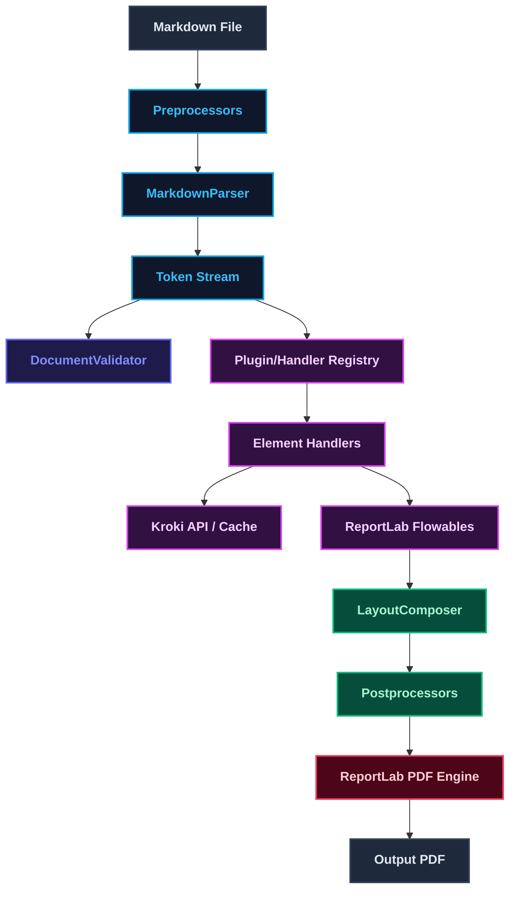

<details className="mb-5 text-lg font-bold">
  <summary>Table of Contents</summary>
  <TOCInline toc={props.toc} exclude="Introduction" />
</details>

# Pure Python Markdown to PDF Conversion

In the modern LLM-driven software stack, Markdown has emerged as the primary language for document interchange. AI agents, chatbots, and retrieval-augmented generation (RAG) pipelines natively generate structured text as Markdown. However, when it comes to presenting these outputs to clients, managers, or regulators, raw text files do not suffice. They expect professionally typeset, print-ready PDF reports, invoices, slide decks, and documentation.

This structural requirement exposes a weakness in current toolchains. Standard solutions for converting Markdown to PDF either pull in heavy, system dependencies or strip away print-focused typesetting controls. To solve this, I designed and built `md2pdf`, a zero-dependency, pure-Python Markdown-to-PDF compiling engine that maps a parsed document tree directly to page-layout objects.

This article explores the architectural challenges of existing PDF generation pipelines and provides a deep dive into how `md2pdf` delivers speed, reliability, and precision.

## The Markdown-to-PDF Challenge in the LLM Era

Generating high-fidelity PDFs from structured text has historically been solved in one of two ways. Both approaches carry substantial drawbacks for modern, cloud-native environments.

### Pandoc-Based Pipelines

The most common conversion path utilizes Pandoc as a bridge (see the [Pandoc PDF Engine Docs](https://pandoc.org/MANUAL.html#creating-a-pdf)). While Pandoc is excellent at document-format translation, generating a PDF requires routing its intermediate outputs through a TeX typesetting engine (like `pdfLaTeX` or `XeLaTeX`), which requires massive LaTeX environments (like TeX Live, >500MB).

This introduces several friction points:

- **Dependency Weight**: A minimal TeX Live distribution occupies hundreds of megabytes. Running this setup in serverless functions (like AWS Lambda) or scaling containers (like Google Cloud Run) causes massive deployment images and slow cold starts.
- **External Helper Binaries**: If your Markdown contains Mermaid flowcharts or LaTeX equations, Pandoc requires external filter binaries (like `mermaid-filter`) which run under Node.js. This forces developers to maintain a multi-language stack (Python, Node.js, and system binaries) in production.
- **Fragile Integration**: When an error occurs in the Node helper or the TeX compiler, it emits opaque command-line errors, making debugging inside automated workflows difficult.

### Headless Chrome or Playwright

To bypass TeX, developers often render Markdown to HTML, load it into a headless browser (such as Puppeteer or Playwright), and print the page to PDF (see the [Playwright PDF Printing Guide](https://playwright.dev/docs/api/class-page#page-pdf)).

While this ensures web-level styling, it breaks down for print typesetting:

- **No Print Control**: Web layout engines do not understand physical pages natively. Page breaks are unpredictable, column heights overflow, and protecting against "orphaned" headings (where a section title sits alone at the bottom of a page) is highly complex.
- **Runtime Footprint**: Spawning a headless Chromium browser instance requires significant RAM and CPU, along with a ~100MB browser package dependency.
- **Performance Overhead**: Compiling a single-page invoice requires initializing a browser process, loading the DOM, waiting for JavaScript rendering, and then serializing the document. This process typically takes between 400 milliseconds and several seconds.

### Other Layout Engine Alternatives

Beyond heavyweight TeX and browser runtimes, several other Python-based libraries and layout engines are commonly used to compile structured text to PDF:

| Alternative Engine | Source                                                                | Primary Failure Modes and Trade-offs                                                                                                                                                                                                                                                                                                                                |
| :----------------- | :-------------------------------------------------------------------- | :------------------------------------------------------------------------------------------------------------------------------------------------------------------------------------------------------------------------------------------------------------------------------------------------------------------------------------------------------------------ |
| **WeasyPrint**     | [WeasyPrint Project Page](https://weasyprint.org/)                    | Requires system-level binary dependencies (like Pango, GObject, and Cairo) for rendering and font handling, complicating container deployments.                                                                                                                                                                                                                     |
| **markdown-pdf**   | [markdown-pdf PyPI Package](https://pypi.org/project/markdown-pdf/)   | Python-native wrapper that compiles Markdown to HTML via `markdown-it-py` and outputs to PDF using `PyMuPDF` (`fitz`). While it is simple, `PyMuPDF` wraps a C-based binary engine (MuPDF) requiring binary wheels, and it lacks formatting controls for math equations (LaTeX), diagrams (Mermaid), repeated headers, or table padding adjustments out-of-the-box. |
| **fpdf2**          | [fpdf2 Project Repository](https://github.com/pyfpdf/fpdf2)           | Pure-Python PDF writer supporting basic inline markdown styling (`markdown=True`) or HTML rendering via `write_html()`. However, it lacks a complete document layout engine, meaning headers, footers, footnotes, diagrams, multi-page tables, and mathematical formulas must be coded manually through helper classes.                                             |
| **xhtml2pdf**      | [xhtml2pdf GitHub Repository](https://github.com/xhtml2pdf/xhtml2pdf) | Pure-Python HTML-to-PDF converter built on ReportLab. It has extremely limited support for modern HTML/CSS standards, and completely lacks native processing for emojis, LaTeX math, or Mermaid flowcharts.                                                                                                                                                         |

Each has its own design trade-offs; for simple document formatting or environments where local binary installation is straightforward, these alternatives can be excellent solutions. However, if your pipeline demands zero external binary configurations, alongside advanced features like inline LaTeX, Mermaid diagrams, multi-page tables with repeated headers, and orphan heading prevention, you may find that you need the custom layout controls provided by `md2pdf`.

## Introducing md2pdf

`md2pdf` was built to address these specific pain points. It is a single-package Python library with zero binary dependencies, designed to convert Markdown documents directly into formatted PDFs.

The design is built on two core libraries:

- **[mistletoe](https://github.com/miyuchina/mistletoe)**: A fast, extensible Markdown parser that generates a standard Abstract Syntax Tree (AST).
- **[ReportLab](https://www.reportlab.com/)**: A low-level Python layout engine that allows drawing lines, placing text, and building flowable document objects on a canvas.

By bypassing both HTML compilation and browser execution, `md2pdf` compiles documents natively. Emojis, math formatting, and diagram nodes compile out of the box.

### Installation

To install `md2pdf`, you can use the `uv` tool manager (recommended) or standard `pip`:

```bash
# Using uv (recommended)
uv tool install pymd2pdf

# Using pip
pip install pymd2pdf
```

For documents requiring heavy offline LaTeX mathematical rendering (such as engineering specifications or academic drafts), you can optionally install the [matplotlib](https://matplotlib.org/) rendering engine:

```bash
# Install with optional matplotlib math engine
pip install "pymd2pdf[matplotlib]"
```

Note: The PyPI package name is registered as `pymd2pdf`, but the CLI command and Python package imports are both named `md2pdf`.

## Deep Dive into the Architecture

The compilation engine is split into four distinct stages to decouple document parsing from low-level page formatting.

<figure className="my-8">



  <figcaption className="text-center text-xs text-gray-400 mt-4">
    The four-stage md2pdf compilation pipeline.
  </figcaption>
</figure>

### Stage 1: Text-Level Preprocessing

The text preprocessor (`PreProcessorRegistry`) processes the raw Markdown string before parsing:

- **YAML Front-Matter Stripping**: Extracts metadata (like title, author, and date) and converts it to PDF document properties.
- **Recursive Includes**: Resolves the `!include filename.md` syntax. The engine recursively reads included files, enabling developers to split massive manuals into modular folders.
- **Emoji Translation**: Scans the text for Unicode emojis and translates them into inline HTML tags pointing to cached Twemoji PNG assets.

### Stage 2: AST Parsing and Validation

`md2pdf` uses an extended `mistletoe` parser to parse Markdown into a clean token stream. Once compiled, the AST passes through a validation gate.

The `DocumentValidator` verifies features before committing to a render:

- It flags syntax issues, empty diagrams, or unsupported nested tables.
- It returns structured warnings or errors, which can be formatted as JSON for CI/CD check integration.

### Stage 3: Direct Flowable Mapping

Each token in the AST is dispatched to its registered handler inside `HandlerRegistry`:

- Standard tags (like headings, blockquotes, and paragraphs) map to ReportLab formatting flowables (like `Paragraph`, `Spacer`, and `Table`).
- Code blocks are processed through [Pygments](https://pygments.org/) to apply syntax styling.
- Mermaid diagrams and LaTeX math blocks compile into cropped, transparent PNG graphics.

#### Concurrent Pre-fetching & Caching

To avoid network delays when compiling document assets sequentially, `md2pdf` implements a thread pool of 5 workers that pre-fetches and processes diagrams concurrently:

1. The pipeline scans the token stream during Stage 3 initialization.
2. It collects all raw Mermaid syntax blocks and LaTeX equations.
3. If an asset exists in the local disk cache (based on a SHA-256 hash of its source string), it is loaded immediately.
4. If not, the workers compile them concurrently via the [Kroki API](https://kroki.io/) (or locally via matplotlib if configured) and save them to the cache.

### Stage 4: Layout and Multi-Pass Compilation

Traditional PDF engines compute page placement in a single pass. However, document elements like Table of Contents (TOC) page numbers, footnotes, and running headers depend on final page structures.

To resolve this, `md2pdf` uses a multi-pass compilation model (up to 5 passes):

1. **Pass 1 (Analysis)**: The engine compiles flowable elements with placeholder measurements. It records the exact page numbers where headings and footnotes land.
2. **Passes 2–4 (Adjustment)**: The engine regenerates flowables using the recorded page numbers. Because adding a Table of Contents or placing footnotes pushes content downstream, the page numbers change. The loop repeats until the page numbers in the footnote and bookmark registries converge.
3. **Final Pass (Render)**: Once the registries converge (or at Pass 5 as a fallback), the final document is built on disk, applying deterministic properties (like pinned timestamps and stable cross-reference IDs) to ensure byte-identical builds.

## Typesetting Safeguards

To match the layout quality of professional typesetting engines, `md2pdf` includes several custom layout components.

### Preventing Orphaned Headings

ReportLab's default layout algorithm can place a heading at the bottom of a page and the following content on the next. `md2pdf` resolves this with a custom `KeepTogetherParts` flowable:

- It tracks the heading alongside the next element (or the first two rows of a table).
- It calculates their combined height. If they cannot fit together on the current page, the engine automatically pushes the heading to the next page.

### Multi-Page Tables

Tables that span multiple pages must remain readable. `md2pdf` automatically applies split protection:

- Table cells wrap text dynamically based on column widths.
- Rows are protected from splitting mid-line.
- Table headers repeat at the top of every page automatically.

### Image Auto-Scaling

The custom `ResizableImage` wrapper manages external assets:

- It reads the canvas boundaries and downscales large images to fit within margins.
- It extracts alt-text captions and renders them as small, centered, styled paragraphs below the graphic.

### Graceful Fallbacks

To ensure builds never crash during network errors or offline work:

- If the Kroki API is unreachable, math blocks fall back to displaying raw LaTeX equations inside a pre-formatted monospace block.
- If emoji images fail to download, the compiler falls back to DejaVu Sans Unicode glyphs.

## Extensibility: The Plugin System

One of the core design goals of `md2pdf` is clean extensibility. Rather than hardcoding custom Markdown extensions or page layouts directly into the engine, the system exposes a pluggable API that allows developers to hook into the compilation pipeline.

Plugins can register at three sequential pipeline stages or supply custom stylesheet overrides:

- **Pre-Processors**: Hook into Stage 1 to transform the raw Markdown text before parsing (e.g., character replacements, shortcodes).
- **Element Handlers**: Hook into Stage 3 to register or replace element mappings from parsed AST tokens to ReportLab `Flowable` instances (e.g., custom containers, graphs).
- **Post-Processors**: Hook into Stage 4 to modify the complete list of compiled ReportLab `Flowable` objects before serialization (e.g., watermarks, page numbering stamps).
- **Stylesheet Overrides**: Merges a custom theme configuration with default layouts before compilation.

### Writing a Custom Pre-Processor

To modify raw Markdown text before it is parsed by `mistletoe`, subclass the `PreProcessor` class and implement the `process` method. For example, to translate emoji shortcodes into Unicode glyphs:

```python
from md2pdf.core.preprocessors import PreProcessor

class EmojiPreProcessor(PreProcessor):
    def process(self, raw_md: str) -> str:
        return raw_md.replace(":warning:", "⚠️")
```

### Writing a Custom Element Handler

To introduce new Markdown components or override default rendering behaviors, subclass the `ElementHandler` class, declare the target `token_type` matching the AST token, and implement the `render` method to return a list of ReportLab `Flowable` objects:

```python
from md2pdf.core.registry import ElementHandler
from reportlab.platypus import Paragraph
from reportlab.lib.styles import getSampleStyleSheet

class CalloutHandler(ElementHandler):
    token_type = "Callout"

    def render(self, token: dict, styles: dict) -> list:
        text = token.get("raw", "")
        style = getSampleStyleSheet()["Normal"]
        return [Paragraph(f"📢 {text}", style)]
```

### Writing a Custom Post-Processor

To mutate page-level structures or run document-wide styling passes, subclass `PostProcessor` and implement `process`. For example, this post-processor stamps a watermark on every page:

```python
from reportlab.platypus import SimpleDocTemplate
from md2pdf.core.postprocessors import PostProcessor

class WatermarkPostProcessor(PostProcessor):
    def __init__(self, text: str = "DRAFT") -> None:
        self.text = text

    def process(self, doc: SimpleDocTemplate, flowables: list) -> list:
        text = self.text

        def _stamp(canvas, doc_ref):
            canvas.saveState()
            canvas.setFont("Helvetica-Bold", 72)
            canvas.setFillAlpha(0.1)
            canvas.translate(doc_ref.pagesize[0] / 2, doc_ref.pagesize[1] / 2)
            canvas.rotate(45)
            canvas.drawCentredString(0, 0, text)
            canvas.restoreState()

        doc._md2pdf_on_later_pages = _stamp  # type: ignore
        return flowables
```

### Plugin Registration

Plugins can be registered dynamically using package entry points in your plugin's `pyproject.toml` file, enabling automated auto-discovery upon package installation:

```toml
[project.entry-points."md2pdf.handlers"]
callout = "my_plugin.handlers:CalloutHandler"

[project.entry-points."md2pdf.preprocessors"]
emoji = "my_plugin.preprocessors:EmojiPreProcessor"

[project.entry-points."md2pdf.postprocessors"]
watermark = "my_plugin.postprocessors:WatermarkPostProcessor"
```

Alternatively, plugins can be registered locally inside an `md2pdf.toml` config file:

```toml
[plugins]
handlers = [
    "my_plugin.handlers:CalloutHandler",
]
preprocessors = [
    "my_plugin.preprocessors:EmojiPreProcessor",
]
postprocessors = [
    "my_plugin.postprocessors:WatermarkPostProcessor",
]
```

## Performance Benchmarks

Although performance was not a primary design goal, bypassing intermediate HTML compilation makes `md2pdf` highly efficient.

To evaluate compile latency, we benchmarked `md2pdf` against **Playwright (Chromium)** and **Pandoc** (using Weasyprint, pdflatex, and xelatex backends) across three standard document sizes on Apple Silicon (macOS-arm64):

- **Cold Start**: Initiates a clean shell command to capture initialization overhead (such as browser startup or module imports).
- **Warm Start (Median)**: Measures subsequent rendering performance inside a running process to evaluate throughput.

### Render Latency Comparison

The charts below illustrate the cold-start and warm-start conversion speeds. Because `md2pdf` maps AST tokens directly to ReportLab flowables, it completes conversions in milliseconds without browser initialization overhead.

<figure className="my-8">
  <div className="grid grid-cols-1 gap-4 lg:grid-cols-2">
    <div>
      
      <p className="mt-2 text-center text-xs text-gray-400">Cold start latency. Lower is better.</p>
    </div>
    <div>
      
      <p className="mt-2 text-center text-xs text-gray-400">
        Warm start median latency. Lower is better.
      </p>
    </div>
  </div>
  <figcaption className="mt-4 text-center text-xs text-gray-400">
    Performance comparison under cold start and warm start configurations.
  </figcaption>
</figure>

## Getting Started and Code Examples

### Command Line Interface

The CLI offers commands for document conversion, live reloading, and testing:

```bash
# Convert a document
md2pdf input.md -o output.pdf

# Run validation checks without outputting a PDF
md2pdf input.md --validate-only --format json

# Compile in offline mode (replaces diagrams with placeholders)
md2pdf input.md --offline

# Enable watch mode to re-render automatically on edits
md2pdf input.md -o output.pdf --watch
```

### Programmatic Python API

For serverless deployments and backend pipelines, the Python API exposes configuration objects:

```python
from md2pdf import convert, Config, Pipeline

# Direct conversion
convert("input.md", "output.pdf")

# Custom pipeline configuration
config = Config(
    offline=False,
    cache_dir=".pdf_cache",
    page_size="Letter",
    orientation="portrait",
    deterministic=True
)

pipeline = Pipeline(config)

# Run AST pre-flight checks
issues = pipeline.validate("# Sample Document")
for issue in issues:
    print(f"[{issue.severity}] {issue.code}: {issue.message}")

# Render to PDF
pipeline.run("# Sample Document\n\nThis is typeset dynamically.")
```

### Stylesheet Configurations

Styles are configured using a local `md2pdf.toml` file. The schema allows overrides for custom margins, custom TrueType fonts, and code highlighting styles:

```toml
[md2pdf]
theme                = "default"
page_size            = "A4"
orientation          = "portrait"
emoji                = true
deterministic        = true

[theme]
font_body            = "DejaVuSans"
font_heading         = "DejaVuSans-Bold"
font_mono            = "DejaVuSansMono"

# Colors (Hexadecimal)
color_body_text       = "#2c3e50"
color_link            = "#3498db"
color_highlight       = "#f1c40f"
color_page_bg         = "#ffffff"

# Table Customization
color_table_header_bg   = "#2c3e50"
color_table_header_text = "#ffffff"
color_table_row_even    = "#ecf0f1"
```

### Example Templates

To see the engine in action, you can explore the pre-formatted Markdown templates alongside their compiled PDF documents using the interactive split viewer below:

<ExampleShowcase />

## Current Limitations and Shortcomings

While `md2pdf` provides a fast, lightweight compilation path, it introduces trade-offs compared to full browser-based or LaTeX layout engines.

### External Service Dependencies

By default, the engine delegates complex drawing tasks to external services:

- **Mermaid Diagrams**: Mermaid flowchart rendering relies on compiling the schema using the remote Kroki API. If the server is offline or network access is restricted, rendering falls back to displaying a monospace placeholder box.
- **LaTeX Mathematical Formulas**: The engine similarly delegates LaTeX equation rendering to Kroki's tikz endpoint.
- **Color Emojis**: Twemoji rendering requires downloading PNG symbols from a remote CDN during the first run.

While a thread pool processes these network calls concurrently, high-latency network routes can delay compilation.

### Local Rendering Limitations

`md2pdf` provides an optional matplotlib backend to support offline, local math rendering (`pip install "pymd2pdf[matplotlib]"`). However, the matplotlib math engine only parses a subset of LaTeX (MathText):

- Advanced mathematical packages, cases, matrix structures, or complex environments will fail validation and fall back to the remote Kroki compilation route.
- Mermaid diagrams cannot be compiled locally by matplotlib, requiring an active connection to render graphics.

### CSS and HTML Layout Constraints

Unlike browser-based printing tools (such as Playwright or WeasyPrint), `md2pdf` is not a full-featured web layout engine:

- It does not support arbitrary HTML elements, inline CSS styles, Flexbox, or CSS Grid layouts.
- Layout overrides must be configured using the specific settings declared in `md2pdf.toml` or custom Python plugins that map AST elements directly to ReportLab flowables.

## Conclusion

`md2pdf` provides a pure-Python alternative for developers who need to generate high-fidelity PDF documents. By shifting the workload from heavy browser binaries to structured AST parsing and direct layout mapping, it fits cleanly into lightweight container runtimes, serverless functions, and local automation workflows.

The source code, example documents, and stylesheets are open source. Try installing it, check the user manual, and build your own document pipelines.

- **GitHub Repository**: [Hari31416/md2pdf](https://github.com/Hari31416/md2pdf)
- **Documentation Guide**: [Docs Deployed on GitHub Pages](https://hari31416.github.io/md2pdf/)
