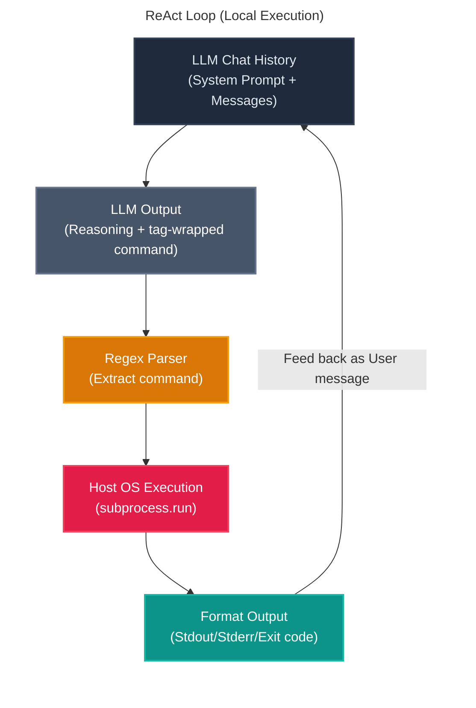
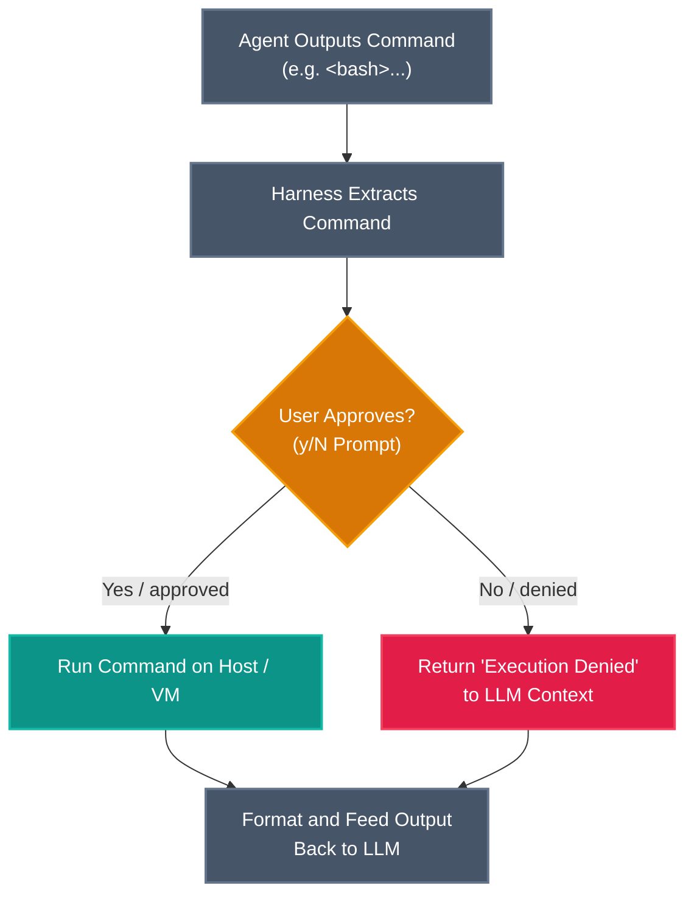
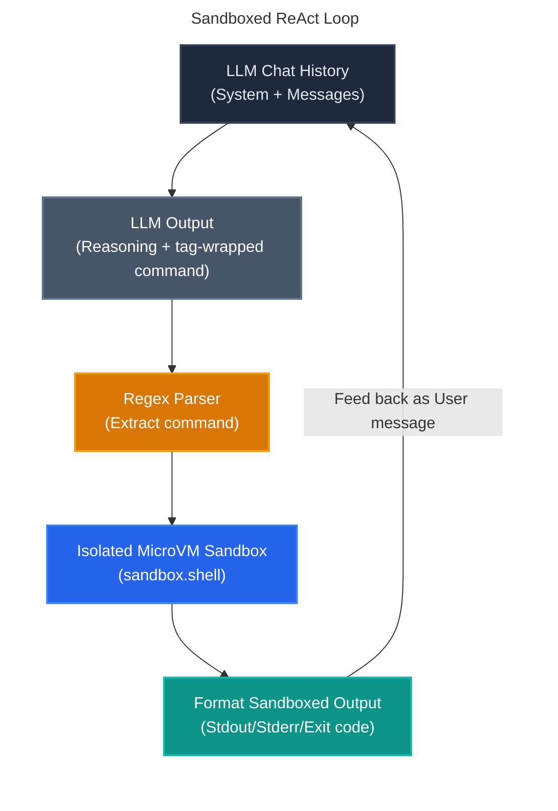

<details className="mb-5 text-lg font-bold">
  <summary>Table of Contents</summary>
  <TOCInline toc={props.toc} exclude="Introduction" />
</details>

# Building a Secure Bash-Executing AI Agent in Under 100 Lines of Python

Large language models (LLMs), at their core, are just text generators. If we want to make them do more, like take action on behalf of the user, we need to give them access to some tools. When equipped with a run-loop and tools, they become **autonomous agents** capable of writing code, debugging systems, and executing terminal commands.

While full-featured frameworks like LangChain, LangGraph, or LlamaIndex provide high-level abstractions, they can often obscure the fundamental mechanics of agent operations.

In this guide, we will build a complete, functional, bash-executing AI agent from scratch in **under 60 lines of Python code**. Then, we will explore why running LLM-generated code directly on your local system is extremely dangerous, and show how to transition the agent to a secure, hardware-isolated sandbox using the `microsandbox` library in just a few additional lines.

## What is an Agent and an Agent Harness?

An **Agent** is a system where an LLM is placed in a closed loop with tools. Instead of answering a query in a single response, the model decides on an action, observes the outcome, and decides on the next step until the task is complete.

> If you are new to agentic workflows, I highly recommend reading my previous article, [Introduction to Agentic AI](https://blogs.hari31416.in/blog/2025/introduction-to-agentic-ai). It covers the foundational concepts of what agents are, their architecture, and how they make decisions. This guide will build directly on those core concepts.

An **Agent Harness** is the infrastructure code (or scaffolding) that manages this loop. The harness is responsible for:

1. Formatting the prompt history.
2. Sending the payload to the LLM.
3. Parsing the LLM's output to detect tool calls.
4. Executing those tools and returning the output as context.

## ⚠️ Important Disclaimer & Security Notice

> [!WARNING]
> This project is strictly for educational and demonstration purposes.
>
> The system prompts and harnesses demonstrated here are kept intentionally **minimal**. We do not include any command sanitization, output filtering, or safety guardrails in the harness or the prompt.
>
> Relying on "prompt engineering" or simple regex checks to prevent malicious bash execution is a recipe for disaster. The only robust way to secure an agent is to run it in a isolated environment where the host system is protected. Never run untrusted agent-generated code directly on your host machine.

## The ReAct Loop

Our agent follows the **ReAct (Reasoning and Acting)** pattern[^4]. This loop allows the model to alternate between reasoning steps ("Thoughts") and action steps ("Actions").

Here is how the control flow moves through the system:

<figure className="my-8">



  <figcaption className="text-center text-xs text-gray-400 mt-4">
    The ReAct loop control flow: alternating between reasoning and executing actions.
  </figcaption>
</figure>

For the system that we will be building, here is the control flow:

1. **Prompt Feed**: The loop starts with a system prompt and the user's request.
2. **Reasoning & Tool Selection**: The LLM outputs its thoughts and formats a tool call inside a custom tag (e.g., `<bash>`).
3. **Parsing**: The harness uses a regular expression to find these tags and extract the raw command.
4. **Execution**: The command runs, and the stdout, stderr, and exit code are captured.
5. **Observation**: The harness formats this output and appends it to the chat history, sending it back to the LLM to trigger the next loop iteration.

## Step-by-Step Implementation: The Minimal Agent

Building a basic agent harness requires only three core components. You can view the complete, self-contained `minimal_agent.py` script in a GitHub Gist[^1].

### 1. Initialization and Setup

First, we load environmental variables and initialize our OpenAI client:

```python
import os, re, subprocess
from dotenv import load_dotenv
from openai import OpenAI

load_dotenv()

client = OpenAI(
    api_key=os.environ["OPENAI_API_KEY"],
    base_url=os.environ.get("OPENAI_BASE_URL"),
)
model = os.environ.get("LITELLM_MODEL", "gpt-oss-120b")
```

This establishes our link to the LLM backend.

### 2. The Minimal Prompt Contract

Next, we define our system instructions. This prompt defines the communication contract, instructing the model to wrap bash commands in `<bash>...</bash>` tags:

```python
SYSTEM_PROMPT = """You are a helpful, agentic coding and system assistant. You have access to a bash shell on the user's machine. You can use it to write bash command or run python code to help you solve the user's request.

To run a bash command, output it inside a `<bash>` and `</bash>` tag, for example:
<bash>ls -la</bash>

To write and run a Python script dynamically, you can bash commands to create a script file and then run it, for example:
<bash>cat << 'EOF' > script.py
print("hello")
EOF
python3 script.py</bash>

Only write one command at a time. Explain your reasoning before calling any command. If you have completed the request, explain your findings/solution clearly.
"""
messages = [
    {
        "role": "system",
        "content": SYSTEM_PROMPT,
    }
]

prompt = input("Enter prompt: ")
messages.append({"role": "user", "content": prompt})
```

### 3. The Runtime Loop & Regex Parsing

Finally, we run an infinite loop that handles sending message history, parsing tool requests using simple regular expressions, executing the command locally via `subprocess.run`, and feeding the outputs back to the LLM:

```python
while True:
    response = client.chat.completions.create(model=model, messages=messages)
    content = response.choices[0].message.content or ""
    print(f"\nAgent:\n{content}")
    messages.append({"role": "assistant", "content": content})

    # Find and execute the first <bash> command if present
    match = re.search(r"<bash>(.*?)</bash>", content, re.DOTALL)
    if match:
        cmd = match.group(1).strip()
        print(f"\n[Running: {cmd}]")
        result = subprocess.run(cmd, shell=True, capture_output=True, text=True)
        output = f"Exit code: {result.returncode}\nStdout:\n{result.stdout}\nStderr:\n{result.stderr}"
        messages.append({"role": "user", "content": output})
    else:
        # Prompt user for their next command/response
        user_input = input("\nYou (type 'exit' to quit): ").strip()
        if user_input.lower() in ["exit", "quit", "q"]:
            break
        messages.append({"role": "user", "content": user_input})
```

## Adding Human-in-the-Loop (HITL) Confirmation

Before moving to sandboxing, we can introduce a simple check to improve safety:

**Human-in-the-Loop (HITL)**. Instead of letting the agent execute commands automatically, the harness asks for user permission.

<figure className="my-8">



  <figcaption className="text-center text-xs text-gray-400 mt-4">
    The Human-in-the-Loop (HITL) flow: intercepting the agent's actions for explicit user approval before execution.
  </figcaption>
</figure>

In our larger harness implementation, it looks like this:

```python
# Parse for bash tags
command = parse_bash_command(assistant_content)
if command:
    # Request confirmation
    confirm = input(f"\n[Confirm] Run command? [y/N]: ").strip().lower()
    approved = confirm in ("y", "yes")

    if approved:
        execution_result = execute_bash(command)
        # Feed result back to LLM...
    else:
        print("\nExecution denied by user.")
        messages.append({
            "role": "user",
            "content": "Command execution was denied/aborted by the user."
        })
```

While HITL is an essential practice for command line workflows, it relies entirely on human vigilance. It is easy to accidentally approve a destructive command (like approving `rm -rf` in the wrong folder, or executing a command containing hidden prompt-injected sequences). True containment requires hardware-level isolation.

## Transitioning to a Sandbox

Running commands natively via `subprocess.run` on your host operating system is highly dangerous. If the LLM generates a command like `rm -rf /` or attempts to upload private credential files to an external server, your system will execute it without hesitation.

To prevent this, we need to run the code in an isolated environment:

- **Local Machine Risk:** Running natively exposes all local files, SSH keys, environment variables, and local network ports.
- **Container Sandboxing:** Running code execution inside container instances (e.g., Docker) isolates the filesystem to a degree, but comes with complex configuration setups and shared host kernel risks.
- **Other Sandboxing Runtimes:** There are numerous sandboxing methods—including serverless runtimes, gVisor[^7], and microVMs (such as AWS Firecracker[^8]). I plan to publish a follow-up article detailing these choices, their performance trade-offs, and security profiles.

For this guide, we will use **`microsandbox`**[^3], an easy-to-use local Python SDK built on top of libkrun[^9] that launches secure, isolated lightweight virtual machines (MicroVMs) on-demand.

<figure className="my-8">



  <figcaption className="text-center text-xs text-gray-400 mt-4">
    The Sandboxed ReAct loop uses a hardware-isolated MicroVM for secure bash command execution.
  </figcaption>
</figure>

## The Sandboxed Agent Code

By switching to `asyncio` and swapping out `subprocess.run` for the `microsandbox` SDK, we can run our agent inside a secure, hardware-isolated environment.

Ensure you install the package first:

```bash
pip install microsandbox
```

You can view the complete, self-contained `sandbox_agent.py` script in a GitHub Gist[^2].

### 1. Async Client and Sandbox Booting

First, we initialize the asynchronous client and spin up our hardware-isolated virtual machine:

```python
import asyncio
import os
import re
from dotenv import load_dotenv
from openai import AsyncOpenAI
from microsandbox import Sandbox

# ... inside main() function ...
print("Creating secure microVM sandbox...")
async with await Sandbox.create(
    "agent-sandbox",
    image="python",
    replace=True,
) as sb:
    print("Sandbox created successfully. Agent loop starting...")
```

Instead of running code directly on the host, this boots an isolated microVM pre-cached with Python.

### 2. Executing Commands Securely Inside the MicroVM

Next, inside the agent loop, instead of calling `subprocess.run`, we use the sandbox's shell client to run commands:

```python
# Find and execute the first <bash> command if present
match = re.search(r"<bash>(.*?)</bash>", content, re.DOTALL)
if match:
    cmd = match.group(1).strip()
    print(f"\n[Running in Sandbox: {cmd}]")
    result = await sb.shell(cmd)
    output = f"Exit code: {result.exit_code}\nStdout:\n{result.stdout_text}\nStderr:\n{result.stderr_text}"
    messages.append({"role": "user", "content": output})
```

The `sb.shell(cmd)` call runs the script in the VM guest kernel. Any modifications to the filesystem, network requests, or potential crashes are restricted to the sandbox.

### 3. Automatic Resource Cleanup

We leverage Python's `async with` context manager. As soon as the agent exits the loop (or hits an exception), the sandbox is automatically stopped, its disk changes are discarded, and resources are freed:

```python
# As context manager exits, the VM is safely destroyed
async with await Sandbox.create(...) as sb:
    # loop ...
```

### What Changed?

- **Async-first Execution:** `microsandbox` uses Python's asynchronous model (`asyncio`), so we upgraded to `AsyncOpenAI` and wrapped our code inside an async context.
- **Sandbox Lifecycle:** We initialize the sandbox with the `async with await Sandbox.create(...)` manager. This pulls a minimal Linux image containing Python, boots a secure microVM, and mounts the execution environment.
- **Secure Command Execution:** The core tool execution step is now routed through `await sb.shell(cmd)`. The command runs inside the MicroVM guest kernel. Any operations, side-effects, or network requests are isolated from the host.

## Limitations of a Minimal Harness

While this under-100-lines agent loop is excellent for learning, building production-grade agent systems requires solving several advanced architectural challenges. The table below compares the limitations of our minimal harness with the requirements of a production-ready harness:

| Architectural Dimension | Minimal Harness (Educational)                         | Production Harness (Enterprise-Grade)                                    |
| :---------------------- | :---------------------------------------------------- | :----------------------------------------------------------------------- |
| **Command Parsing**     | Regex extraction of text tags (e.g., `<bash>`)        | Native Tool Calling (JSON schema + model-native function parameters)[^5] |
| **Execution Output**    | Raw text parser / stdin / stdout capture              | Structured output & schema validation (e.g., Pydantic models)[^10]       |
| **Memory Management**   | Append all history (overflows context window)         | Context management (summarization, sliding windows, or RAG memory)[^6]   |
| **Tool Execution**      | Writes and executes arbitrary scripts dynamically     | Pre-built composable tool library with restricted permissions            |
| **Security & Sandbox**  | Runs directly on host or requires manual confirmation | Hardware-level microVM isolation with automatic cleanup[^3]              |

## Conclusion

Understanding how AI agents work doesn't require importing massive frameworks. By stripping the system down to its core—a simple API client, a regular expression, and a run loop—you can see that agentic execution is fundamentally straightforward.

However, giving a language model shell access requires a robust approach to security. By transitioning from `subprocess.run` to sandboxed runtimes like `microsandbox`, we can ensure that code execution remains secure, isolated, and safe to deploy.

[^1]: [Minimal Agent GitHub Gist (Hari31416)](https://gist.github.com/Hari31416/2b1a2ee1a3d35c634a8281505f5814e6)

[^2]: [Sandboxed Agent GitHub Gist (Hari31416)](https://gist.github.com/Hari31416/a50aa19b9355fd25aaddfcec274c5ec8)

[^3]: [microsandbox SDK (GitHub)](https://github.com/superradcompany/microsandbox)

[^4]: [Yao et al., 2022 - ReAct: Synergizing Reasoning and Acting in Language Models (arXiv)](https://arxiv.org/abs/2210.03629)

[^5]: [OpenAI Function Calling Guide (OpenAI)](https://platform.openai.com/docs/guides/function-calling)

[^6]: [LangChain Docs: Memory Concepts (LangChain)](https://docs.langchain.com/oss/python/concepts/memory)

[^7]: [gVisor Application Kernel (Google)](https://github.com/google/gvisor)

[^8]: [Firecracker microVM (AWS)](https://github.com/firecracker-microvm/firecracker)

[^9]: [libkrun Virtualization-based process isolation (GitHub)](https://github.com/libkrun/libkrun)

[^10]: [OpenAI Structured Outputs Guide (OpenAI)](https://platform.openai.com/docs/guides/structured-outputs)
